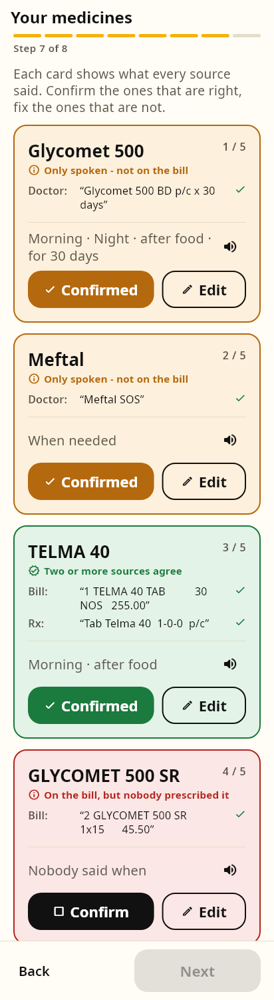
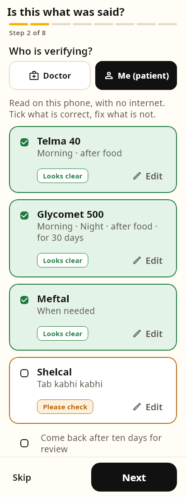
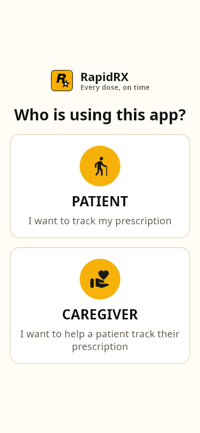
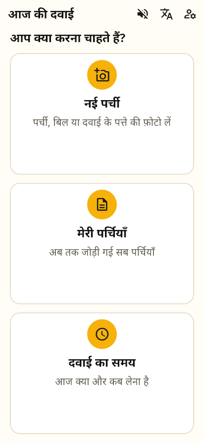
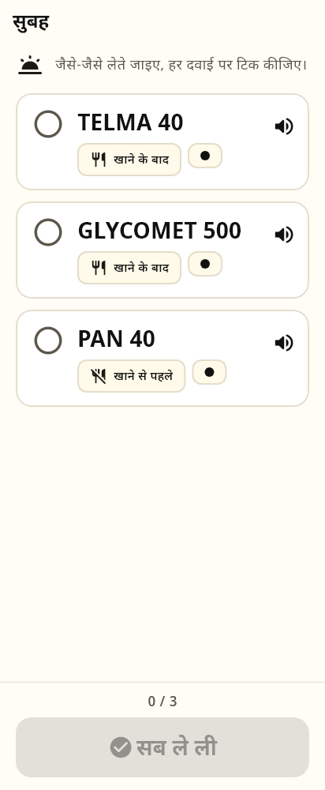
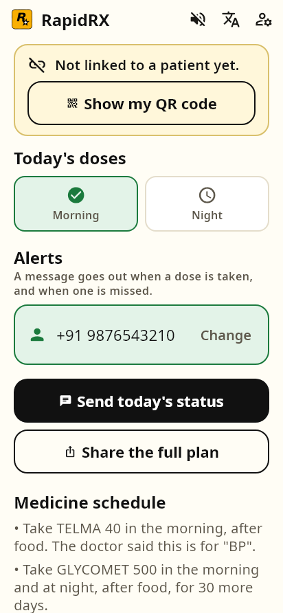
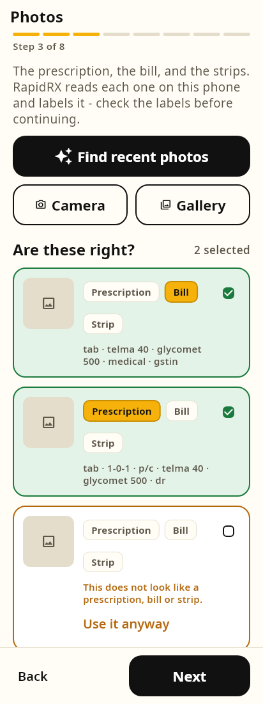
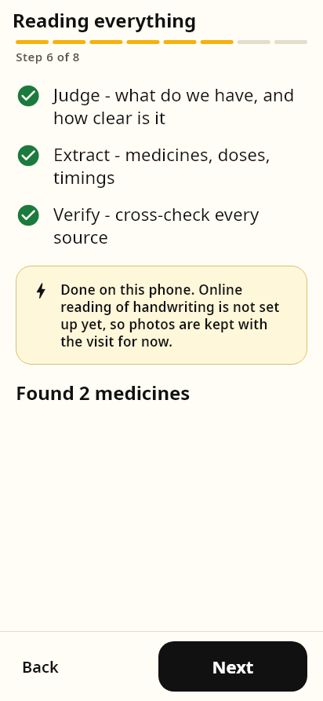
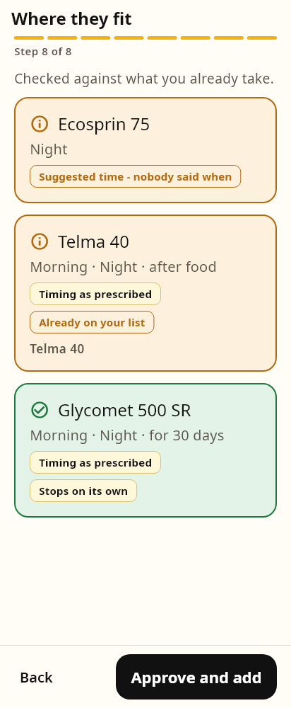
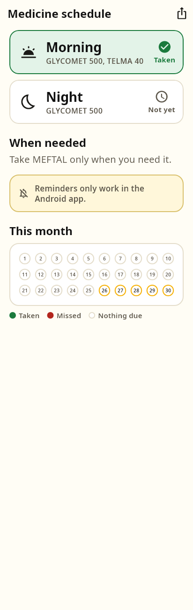

<div align="center">


# RapidRX

**Every dose, on time · हर दवाई, सही समय**

*A prescription understanding agent that never guesses a dose.*

Hack-e-Awadh · UP AI Labs, Lucknow · HealthTech · **PS-01 Prescription Understanding Agent**
<br>Team **AfterBurners**


</div>

---

## The problem

Even the best models read Indian handwritten prescriptions correctly only about half the time.
A system that bets on reading handwriting is right half the time about something that goes into
a person's body.

## The idea

RapidRX does not bet on handwriting. It collects **four sources that cross-question each other**:

| Source | What it is trusted for |
|---|---|
| 🗣️ **The doctor's own words** | *When* to take it — the doctor is the authority on timing |
| 📄 **The prescription photo** | Everything, when it can be read |
| 🧾 **The printed pharmacy bill** | *What* the medicine is — printed text reads at over 99% on the phone |
| 💊 **The chemist's note** | Catches a substitution at the counter |

A deterministic merge engine lines them up and marks every medicine 🟢 the sources agree,
🟡 needs a look, or 🔴 they disagree. **Where they disagree, both readings are shown and a person
decides.** Once approved, the plan becomes a daily schedule that reminds the patient, logs what
was taken, and tells the family on WhatsApp what was missed.

> **The rule behind every decision:** the app never silently picks between conflicting sources,
> and never invents a dose.

<div align="center">

&nbsp;&nbsp;

</div>

## How it works

```
 ONBOARDING  language · voice help · phone + OTP · name · PIN · role
             patient: health profile (age, optional height/weight/Ayushman mock)
             caretaker: family or paid → QR for the patient to scan
      │
      ▼
 NEW PRESCRIPTION — eight steps
   1 what the doctor said ─▶ 2 who is verifying? doctor checklist or me
   3 photos: prescription + bill + strips, read on the phone and labelled
   4 the pharmacy page     ─▶ 5 is this what the chemist said?
        a disagreement asks before anything turns green
   6 judge · extract · verify — on the phone
        └─ optional, online, with consent: read the handwriting with Gemini
   7 one card per medicine, 🟢🟡🔴, every source quoted
   8 where each fits beside what you already take ─▶ APPROVE
      │
      ▼
 EVERY DAY   reminder at the time, a nudge 30 min later, then silence
             tick each medicine ─▶ "सब ले ली" ─▶ the family is told on WhatsApp
             missed? the caregiver hears about it, not a louder alarm
```

Everything above the Gemini line runs **on the phone**, with no key and no network: ML Kit
reads the photos, a rule-based parser turns `1-0-1 p/c x 10 days` and *"subah ek, khane ke baad"*
into structure, and plain Dart does the cross-checking.

## Screens

| Onboarding | Patient | Taking a dose | Caregiver |
|---|---|---|---|
|  |  |  |  |

| Photos, labelled | On the phone | Where they fit | Schedule + month |
|---|---|---|---|
|  |  |  |  |

Every image is a **golden test**: the real app rendered at phone size with the real fonts, driven
by the real controller. If the parser or the merge engine changes what a row says, these pictures
change with it.

## Built for the person who actually takes the tablets

- **Hindi and English**, chosen once — medicine names stay in English letters everywhere, because
  the patient matches them against the strip in their hand
- **Body text never below 20pt, tap targets never below 64px**, one decision per screen
- **Voice help** reads every screen aloud in the chosen language, and keeps working offline
- **Pictograms with words**, never instead of them
- **Two gates before a dose is logged** — a tick per medicine, then "सब ले ली"

## Guardrails

- **Consent is a gate.** Nothing is captured before a plain-words yes.
- **A content gate on every input** turns away a holiday photo or a café receipt — with the reason
  shown, and always a "use it anyway".
- **The one cloud call** (Gemini, for handwriting) happens only after a person presses Read on a
  card that says exactly what leaves the phone. It gets no extra trust: its rows land in the same
  merge, against the same printed bill.
- **A red card cannot be confirmed** until a person picks which source is right.
- **A timing the doctor gave is never moved.** A timing nobody gave is labelled a suggestion.
- **Nothing claims more than it did** — "sent" and "opened in WhatsApp" are different words.

## Run it

Requires Flutter 3.47 (Dart 3.13).

```bash
flutter pub get
flutter test
```

```powershell
.\tools\run.ps1 -Device windows     # the phone layout, on a laptop
.\tools\web.ps1                     # release web build on localhost:8080
.\tools\run.ps1 -Build apk          # the Android APK
```

Keys are optional and never committed — see [`docs/RUNBOOK.md`](docs/RUNBOOK.md).

## Project layout

```
lib/
  domain/     the deterministic core — pure Dart, no Flutter
              sig_parser · mention_extractor · name_matcher · merge_engine
              content_gate · schedule_engine · placement_advisor · reminder_planner
  features/   onboarding · wizard · doses · caregiver · visit · patient · medicines
  platform/   native capabilities, each split so the stub says why it cannot, never fakes it
              text_recogniser · gallery_scanner · dictation · dose_reminders
  ai/         the Gemini client — the only cloud call
  core/       theme · strings (en + hi) · voice (Kokoro) · shared widgets
test/         271 tests, including golden screenshots of every screen in both languages
docs/         decisions · gotchas · runbook · voice-agent design · HANDOFF (done vs left)
```

## Honest about what it is

This is a hackathon build. Medical data stays on the phone (no cloud database yet), the OTP is a
demo code and the screen says so, and the phone-call voice agent is
[designed](docs/VOICE_AGENT.md) but not built. **What is built vs still open** is in
[`docs/HANDOFF.md`](docs/HANDOFF.md). The runbook lists
[gaps to say out loud](docs/RUNBOOK.md#known-gaps--say-them-before-anyone-finds-them), and why
each choice was made is in [`docs/DECISIONS.md`](docs/DECISIONS.md).

**RapidRX is not medical advice.** Every row that reaches a schedule was checked by a person.

---

<div align="center">
<sub>Built by Team AfterBurners for Hack-e-Awadh 2026 · Fonts: Noto Sans (SIL Open Font License)</sub>
</div>
