# RapidRX — Implementation Plan

**Rebuild specification · Hack-e-Awadh (UP AI Labs), Lucknow · Track: HealthTech · PS-01 Prescription Understanding Agent**
Team AfterBurners

> One purpose: let a person sitting in a hackathon hall rebuild **this exact app** from an empty
> directory — without this conversation, without guessing, and without rediscovering a single trap
> already hit. Every decision is written with its reason, because the reason is what lets you adapt
> when the day does not go to plan.

---

## Contents

| § | | § | |
|---|---|---|---|
| [0](#0-the-repository) | The repository & commit history | [9](#9-extraction-pipeline) | Extraction pipeline |
| [1](#1-the-product) | The product | [10](#10-the-merge-engine) | The merge engine |
| [2](#2-constraints) | Constraints | [11](#11-schedule-doses-and-reminders) | Schedule, doses, reminders |
| [3](#3-machine-setup) | Machine setup | [12](#12-caregiver-sharing-and-whatsapp) | Caregiver & WhatsApp |
| [4](#4-dependencies) | Dependencies | [13](#13-the-voice-agent--twilio-calls) | **The voice agent (Twilio calls)** |
| [5](#5-assets) | Assets | [14](#14-voice--kokoro-tts) | Voice / Kokoro TTS |
| [6](#6-design-system) | Design system | [15](#15-android-configuration) | Android configuration |
| [7](#7-screen-by-screen) | **Screen by screen (with images)** | [16](#16-secrets-and-tooling) | Secrets & tooling |
| [8](#8-data-storage-and-backend) | Data, storage, backend | [17](#17-testing-strategy) | Testing strategy |
| | | [18](#18-rebuild-order) | Rebuild order |
| | | [19](#19-decision-index-adr-1--adr-38) | ADR index |
| | | [20](#20-demo-day--gaps--cut-list) | Demo day, gaps, cut list |

---

## 0. The repository

**https://github.com/shikharshahi/HACK**

```bash
git clone https://github.com/shikharshahi/HACK.git
```

The Flutter project is at the repository root (`pubspec.yaml`, `lib/`, `docs/`, `tools/`).

### 0.1 Commit history to match

Rebuilding "to the same history" means reproducing these commits in this order. Every one is a
working, tested state — if time runs out, the last commit you reach is still demonstrable.

| # | SHA | Time (IST) | Commit |
|---|---|---|---|
| 1 | `aaca6b2` | 25 Sep 16:58 | Step 1: project setup, design system, role-select first screen |
| 2 | `1a8130b` | 25 Sep 18:34 | Add local web preview for fast iteration |
| 3 | `ebd2612` | 25 Sep 18:42 | Use the team logo as the app mark and launcher icon |
| 4 | `585b38f` | 25 Sep 19:05 | Onboarding chain: splash, language, saving, role — and localisation |
| 5 | `0024a9e` | 25 Sep 19:13 | Centre the onboarding content and use icons that mean something |
| 6 | `c81f0b8` | 25 Sep 19:41 | Onboarding: voice help, phone + OTP, name, backup number, PIN |
| 7 | `4254c3b` | 25 Sep 19:59 | Fix voice: step sync, false "no voice", stale web builds |
| 8 | `a753e76` | 25 Sep 20:06 | Per-screen recorded voice prompts, and give the language screen a voice |
| 9 | `916ad84` | 25 Sep 20:19 | Patient menu, always-on onboarding, voice paused |
| 10 | `796113d` | 25 Sep 20:50 | Step 2: the visit screen — four captures, local-first, consent-gated |
| 11 | `5c27a65` | 25 Sep 20:54 | Shorthand parser: prescription sig to a structured schedule, in code |
| 12 | `6ee504b` | 25 Sep 20:58 | Merge engine: cross-check the sources, never pick a side |
| 13 | `965dd42` | 25 Sep 21:00 | Add the rebuild runbook and the gotchas log |
| 14 | `07b0c90` | 25 Sep 21:42 | Schedule engine: verified medicines to "what do I take today" |
| 15 | `2ea665f` | 25 Sep 21:46 | On-device analysis, placement advice, and the medicine store |
| 16 | `74790ea` | 25 Sep 21:59 | New prescription is now a seven-step wizard |
| 17 | `c3176c8` | 25 Sep 22:20 | Wizard goldens driven by the real controller, and two fixes they found |
| 18 | `7425bd4` | 25 Sep 22:56 | Make extraction actually extract: dictation, OCR, four sources that cross-check |
| 19 | `8e6c397` | 25 Sep 23:10 | Medicine cards from the plan, and Kokoro TTS instead of recorded clips |
| 20 | `520a427` | 25 Sep 23:13 | Drop two redundant imports |
| 21 | `57f193d` | 26 Sep 05:38 | One mic button, a menu that fits, and a full-page writing screen |
| 22 | `7e2ff13` | 26 Sep 05:55 | Content guardrails on every input, and one combined photo step |
| 23 | `f65dca0` | 26 Sep 06:04 | Daily dose flow: take, tick, log, and see what was missed |
| 24 | `49f9241` | 26 Sep 06:12 | Wire Gemini for handwriting, consent-gated and budgeted |
| 25 | `155ecda` | 26 Sep 06:28 | The caregiver half: share the plan, and alert on WhatsApp |
| 26 | `f310ff0` | 26 Sep 07:00 | Queue caregiver alerts that cannot leave the phone |
| 27 | `1cf6be3` | 26 Sep 07:00 | Dose reminders, and the first Android build that actually works |
| 28 | `e46699e` | 26 Sep 07:20 | Add implementation_plan.md: the full rebuild specification |

### 0.2 The other documents

| Doc | Holds |
|---|---|
| `docs/PLAN.md` | Product plan, research, locked product decisions D1…D18 |
| `docs/DECISIONS.md` | **ADR-1 … ADR-37** — why each thing is the way it is |
| `docs/PROGRESS.md` | Steps 1–11, what each built and what verified it |
| `docs/REBUILD.md` | The short operational runbook (this file is the long form) |
| `docs/GOTCHAS.md` | Every trap already hit, with the fix |

---

## 1. The product

Even the best models read Indian handwritten prescriptions correctly only about half the time. So
RapidRX does not bet on reading handwriting. It collects **four sources that cross-question each
other** — the doctor's own words, the prescription photo, the printed pharmacy bill, and the
chemist's note — merges them with deterministic rules, and shows a human every row with the evidence
behind it. Once a person approves, it becomes a daily schedule that reminds the patient, logs what
was taken, and tells the family what was missed.

### 1.1 End-to-end flow

```
  ┌──────────────────────────── ONBOARDING (once) ────────────────────────────┐
  │ splash → language → saving → voice? → phone → OTP → name(+backup) →       │
  │ [backup OTP] → PIN → PIN again → ROLE                                      │
  └───────────────┬───────────────────────────────────┬───────────────────────┘
                  │ PATIENT                           │ CAREGIVER
                  ▼                                   ▼
        ┌─────────────────────┐            ┌──────────────────────────┐
        │  Patient menu       │            │  Caregiver home          │
        │  1 New prescription │            │  · today, per slot       │
        │  2 My prescriptions │            │  · WhatsApp number       │
        │  3 Medicine schedule│            │  · send status / plan    │
        └──────┬──────────────┘            └──────────────────────────┘
               │ 1                                      ▲
               ▼                                        │ plain-text message
   ╔═══════════════════════ THE WIZARD (8 steps) ═══════╪═══════════════════╗
   ║                                                     │                   ║
   ║  1 doctorWords ──▶ 2 doctorTakeaways                │                   ║
   ║       (speak/write)      (tick & edit)              │                   ║
   ║            │                   │                    │                   ║
   ║            ▼                   ▼                    │                   ║
   ║  3 photos  ── prescription + bill + strips ─────────┤                   ║
   ║       (find recent / camera / gallery → label → "are these right?")     ║
   ║            │                                        │                   ║
   ║            ▼                                        │                   ║
   ║  4 pharmacyWords ──▶ 5 chemistTakeaways             │                   ║
   ║            │                                        │                   ║
   ║            ▼                                        │                   ║
   ║  6 processing ── ML Kit OCR + SigParser + MergeEngine (all on device)   ║
   ║            │     └─ optional, online, consent-gated: Gemini handwriting ║
   ║            ▼                                                            ║
   ║  7 medicines ── one card per row, 🟢🟡🔴 with quoted evidence            ║
   ║            │                                                            ║
   ║            ▼                                                            ║
   ║  8 placement ── where new medicines sit → APPROVE                       ║
   ╚════════════╪════════════════════════════════════════════════════════════╝
                ▼
      MedicineStore + ScheduleEngine
                │
      ┌─────────┴──────────┬────────────────────┐
      ▼                    ▼                    ▼
  Schedule screen     DoseScreen           ReminderPlanner
  (slots + month)     (tick each →          (due time, +30 nudge)
                       "सब ले ली")
                          │
                          ▼
                   CaregiverNotifier
                          │
        ┌─────────────────┼──────────────────────┐
        ▼                 ▼                      ▼
  Twilio / wa.me    📞 voice call to      (§13, designed)
  family's WhatsApp    the patient  ──▶ keypress writes back
                       1 = taken            to the dose log
```

**The product rule that governs every technical decision:** the app never silently picks between
conflicting sources, and never invents a dose. Where sources disagree, both are shown and a human
decides.

---

## 2. Constraints

| Constraint | Consequence |
|---|---|
| Flutter, one codebase | Android APK is the product; Windows/web run the **same portrait layout**, so a laptop demo shows exactly what the phone shows |
| Offline-first | Parsing, merging, scheduling, placement and reminder planning all run on-device with no key and no network |
| Edge computing used heavily | OCR is ML Kit on-device; shorthand parsing is code, not a model; only handwriting and loose speech ever go to the cloud |
| Elderly users, Hindi + English | Body ≥20pt, tap targets ≥64px, pictograms **with** words, one decision per screen |
| Hackathon time budget | `shared_preferences` instead of Firestore, hardcoded OTP, keys via `--dart-define` — each shortcut written down with what it would become |
| Public repository | No key is ever committed |

---

## 3. Machine setup

Verify before you start, not at 09:05.

```bash
flutter --version
```

Expect **Flutter 3.47.2 / Dart 3.13.2**. On the machine this was built on, Flutter lives at
`C:\flutter` and **is not on PATH** — call `C:\flutter\bin\flutter.bat`.

```bash
flutter doctor -v
```

Green for: Android toolchain (**SDK 36**, **JDK 17**) and either Windows or Chrome. Accept licences
now with `flutter doctor --android-licenses`.

Also have: Node (for `tools/serve.js`), Python (the patch scripts), two Android phones with USB
debugging **already enabled**, cables, and the Gemini key somewhere that is not the repo.

---

## 4. Dependencies

```yaml
dependencies:
  flutter: {sdk: flutter}
  shared_preferences: ^2.3.3              # device choices AND (for now) all medical data
  flutter_tts: ^4.2.0                     # fallback voice, behind Kokoro
  crypto: ^3.0.6                          # SHA-256 PIN hash
  audioplayers: ^6.1.0                    # plays cached Kokoro WAVs
  image_picker: ^1.1.2                    # prescription / bill / strip photos
  record: ^6.1.1                          # doctor / chemist audio   ← see trap
  path_provider: ^2.1.5                   # visit media + voice cache folders
  cross_file: ^0.3.4+2                    # file path on Android, blob URL on web
  http: ^1.2.2                            # Kokoro, Gemini, Twilio
  speech_to_text: ^7.0.0                  # dictation
  google_mlkit_text_recognition: ^0.15.0  # on-device OCR, Latin + Devanagari
  photo_manager: ^3.12.0                  # recent-photo scan
  share_plus: ^13.3.0                     # share the plan anywhere
  url_launcher: ^6.3.2                    # wa.me fallback
  flutter_local_notifications: ^22.3.1    # dose reminders — v22 takes NAMED arguments
  timezone: ^0.11.1                       # zonedSchedule needs a TZDateTime
```

> ### ⚠ The trap that means no APK exists
> `record ^5.2.0` resolves `record_linux 0.7.2`, which does **not** implement the newer
> `record_platform_interface`. `kernel_snapshot` fails and **no Android APK builds at all**. Because
> the web/desktop loop never runs that step, you will not find out until you first try to build an
> APK. Use `record: ^6.1.1`, and **build a debug APK inside the first hour**, before anything depends
> on it.

`pubspec.lock` is committed. If something resolves differently on the day, trust the lock.

---

## 5. Assets

### 5.1 Images

| Path | What | Used by |
|---|---|---|
| `assets/images/logo_mark.png` | The R★ mark on an amber rounded square | `RxLogo`, launcher icon on every platform |
| `assets/images/logo.png` | Full lockup | Reference / deck |


The launcher icon on **all** platforms is generated from `logo_mark.png` — Android mipmaps, Windows
`.ico`, web favicon, PWA icons. A default Flutter icon on a demo phone reads as unfinished, and it is
five minutes of work (ADR-10).

### 5.2 Fonts — bundled, never downloaded

```
assets/fonts/NotoSans-Regular.ttf            NotoSans-SemiBold.ttf            NotoSans-Bold.ttf
assets/fonts/NotoSansDevanagari-Regular.ttf  NotoSansDevanagari-SemiBold.ttf  NotoSansDevanagari-Bold.ttf
```

Declared as families `NotoSans` and `NotoSansDevanagari`, with Devanagari as the **fallback family**
on every text style. Google Fonts at runtime would mean the Hindi UI renders as tofu boxes in a hall
with no Wi-Fi (ADR-2). This is an offline-first app; the fonts are part of it.

---

## 6. Design system

### 6.1 Palette — `lib/core/theme/app_colors.dart`

| Token | Hex | Role |
|---|---|---|
| `amber` | `#F6B20A` | Brand accent |
| `amberDark` | `#C98D00` | Accent on light fills, "due now" |
| `amberSoft` | `#FFF7DA` | Attention fill |
| `amberBorder` | `#D9C06C` | Attention border |
| `ink` | `#111111` | Primary text, primary buttons |
| `inkSoft` | `#1B1A17` | Icons |
| `muted` | `#5D574B` | Secondary text |
| `paper` | `#FFFDF5` | Scaffold background |
| `surface` | `#FFFFFF` | Cards |
| `hairline` | `#E4DDCB` | Borders |
| `green` / `greenSoft` | `#1B7A3D` / `#E3F3E8` | 🟢 agreed · taken |
| `warn` / `warnSoft` | `#B4690E` / `#FDF0DC` | 🟡 needs a look |
| `red` / `redSoft` | `#B3261E` / `#FBE7E5` | 🔴 conflict · missed |

The status colours are **darkened well past the Material defaults**: they are the 🟢🟡🔴 language used
on verification cards, strip checks and the dose calendar, and must stay distinguishable for older
eyes.

### 6.2 Type & spacing — `lib/core/theme/app_theme.dart`

Baked into `ThemeData` so no screen can quietly break them (ADR-4):

```dart
static const double tapTarget = 64;   // every button and tile starts here
static const EdgeInsets pagePadding = EdgeInsets.symmetric(horizontal: 20, vertical: 16);
static const double radius = 20;
fontFamily: 'NotoSans', fontFamilyFallback: ['NotoSansDevanagari']
```

| Element | Spec |
|---|---|
| Body text | **never below 20pt** on patient-facing screens |
| AppBar | paper background, elevation 0, 24pt bold title, 28px icons |
| Filled button | ink fill, white text, 22pt bold, full width, min height 64 |
| Outlined button | 2px ink border, same metrics |
| Scaffold | `paper` (`#FFFDF5`) |

### 6.3 Shared widgets — `lib/core/widgets/`

| Widget | Purpose |
|---|---|
| `PhoneShell` | Constrains to a portrait phone frame on desktop/web so one layout serves all targets (ADR-3) |
| `BigChoiceTile` | Large icon + title + subtitle tile for every either/or question; has a `compact` variant |
| `OnboardingScaffold` + `BigTextField` | Centred one-question-per-screen layout |
| `RxLogo` / `RxWordmark` | The mark, optional tagline |
| `NextStepNote` | Amber "what's next" note. **Remove from any screen that is now real** before the demo |

### 6.4 UX principles actually enforced

1. **One decision per screen** — onboarding is nine screens, not one form.
2. **Centred content** in onboarding (commit 5).
3. **Icons that mean the thing** — a person for patient, two people for caregiver; not decorative emoji.
4. **Pictograms with words, never instead of them.**
5. **Medicine names are never translated** — English letters exactly as printed, in the Hindi UI too, because the patient must match the pack in their hand (plan D13).
6. **Nothing is silently discarded** — every rejection names what caused it and offers "use it anyway".
7. **The app never claims more than it did** — "sent" and "opened in WhatsApp" are different words.

---

## 7. Screen by screen

Each golden below is the **pixel specification**. Rebuild against these, not against memory.
All are 412×892, real fonts, both languages.

### 7.1 Onboarding — the stage machine (`lib/app.dart`)

```dart
enum _Stage { splash, language, saving, voice, phone, phoneOtp,
              profile, backupOtp, pin, pinConfirm, ready }
```

Resume rule on launch, in this exact order:

```dart
if (DevFlags.alwaysShowOnboarding) return _Stage.language;
if (prefs.language == null)         return _Stage.language;
if (prefs.voiceHelp == null)        return _Stage.voice;
if (prefs.phoneNumber == null)      return _Stage.phone;
if (prefs.name == null)             return _Stage.profile;
if (!prefs.hasPin)                  return _Stage.pin;
return _Stage.ready;
```

#### Splash — 3 seconds, English then Hindi

| | |
|---|---|
| 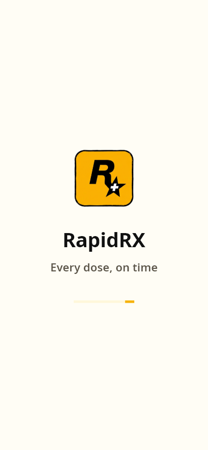 |  |

**Copy:** tagline `Every dose, on time` / `हर दवाई, सही समय`. Logo mark centred, wordmark, tagline
below. Auto-advances after 3s.

#### Language — the only screen that is bilingual at once

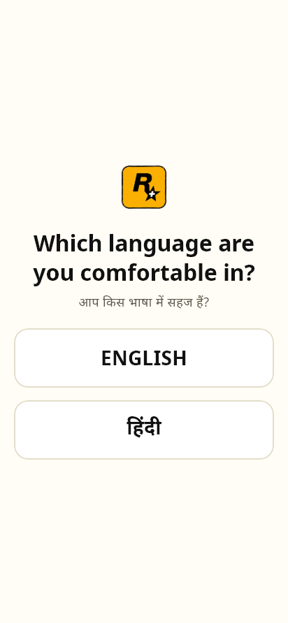

Question shown in **English and Hindi together**, because the user cannot yet have chosen. Exactly
two options: **हिंदी** and **ENGLISH**. Two `BigChoiceTile`s.

#### Saving preference — 3 seconds


**Copy:** `Saving your preference…` / `आपकी पसंद सेव हो रही है…`
**The entire app switches language after this screen.**

#### Voice help

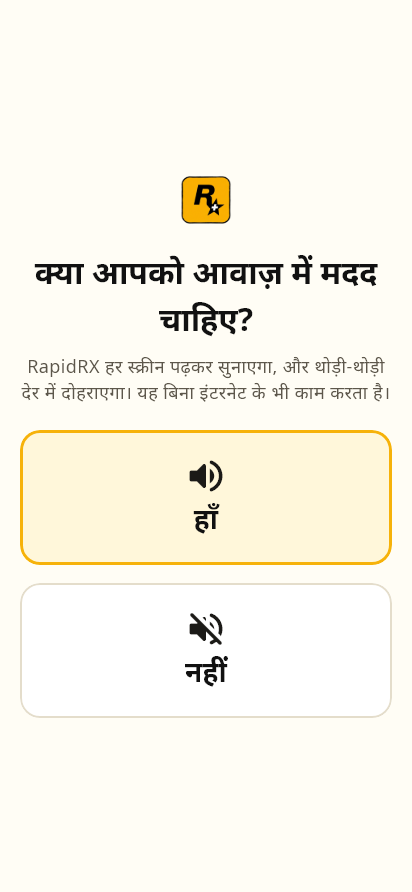

**Copy:** `Do you need voice help?` / `क्या आपको आवाज़ में मदद चाहिए?`
If yes: every subsequent screen reads its **ask and why** aloud, in the chosen language, repeating
every **10 seconds**, and it works offline once the cache is warm.

#### Phone → OTP → profile → PIN

| Phone | OTP | Profile | PIN |
|---|---|---|---|
| 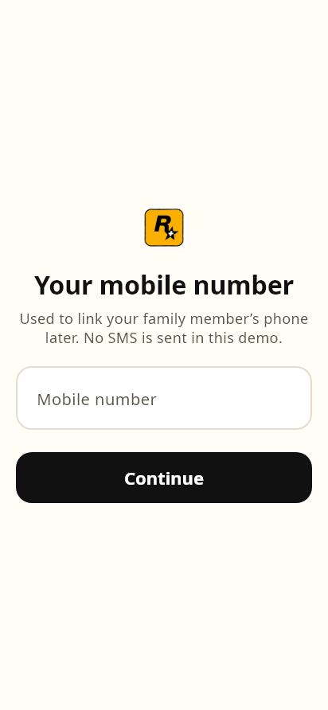 | 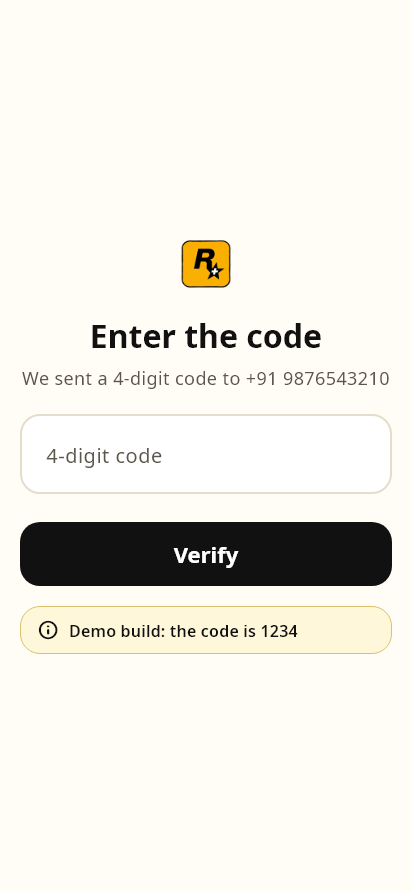 | 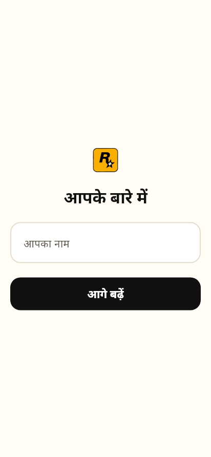 | 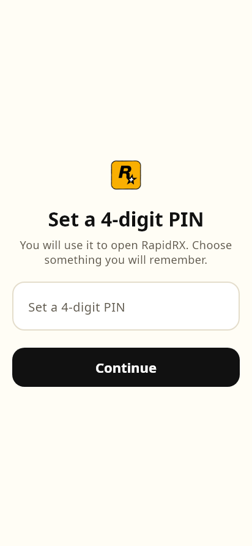 |

- **Phone** — 10 digits, `+91` prefix shown.
- **OTP** — the code is **hardcoded `1234`**. No SMS is sent: Firebase phone auth needs the paid Blaze plan (ADR-14 / plan D15). The screen says so in a demo hint.
- **Profile** — name, plus an **optional** backup/caregiver number. If given, a second OTP screen follows. *This number is what the caregiver alerts later go to.*
- **PIN** — set, then re-enter. Stored as a **SHA-256 hash**, never the PIN itself.

#### Role

| | |
|---|---|
|  | 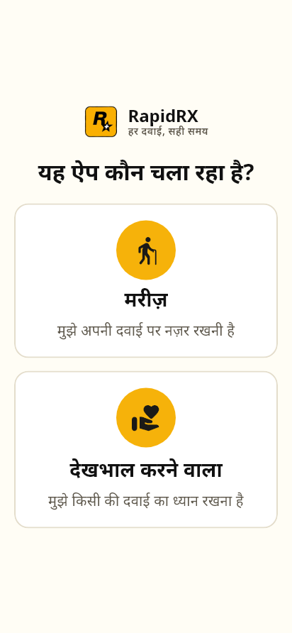 |

**Copy:** `Who is using this app?` / `यह ऐप कौन चला रहा है?`

| | English | Hindi |
|---|---|---|
| **Patient** | `PATIENT` — *I want to track my prescription* | `मरीज़` — *मुझे अपनी दवाई पर नज़र रखनी है* |
| **Caregiver** | `CAREGIVER` — *I want to help a patient track their prescription* | `देखभाल करने वाला` — *मुझे किसी की दवाई का ध्यान रखना है* |

> ### ⚠ Voice ownership (ADR-15) — build it this way from the start
> If the user moves fast, the previous screen keeps talking over the new one. `VoiceGuide` holds an
> ownership token (`_speaker`); each screen calls `stopIfSpeaking(owner)` on the way out and claims
> the voice on the way in. Four regression tests cover it.

### 7.2 Patient menu

| | |
|---|---|
| 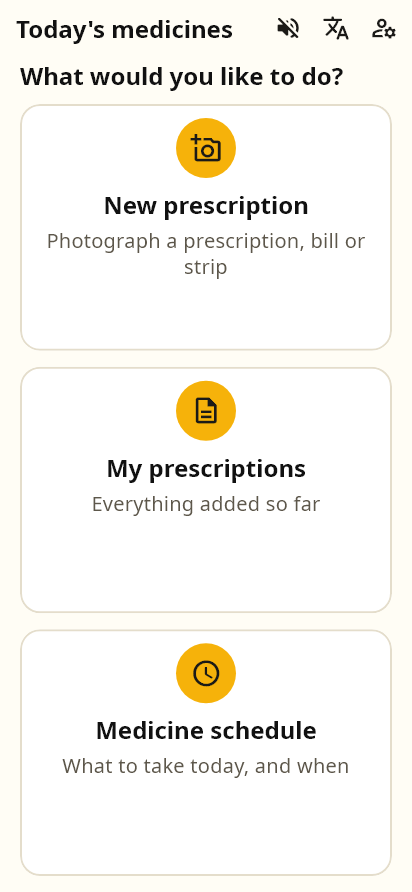 |  |

Three large tiles. The patient lands on a **menu, not on today's doses** (ADR-19):

1. `New prescription` / `नई पर्ची` → the wizard
2. `My prescriptions` / `मेरी पर्चियाँ`
3. `Medicine schedule` / `दवाई का समय`

> All three tiles must be visible **without scrolling** — this was specifically fixed in commit 21.

### 7.3 My prescriptions

| Empty | Filled |
|---|---|
|  | 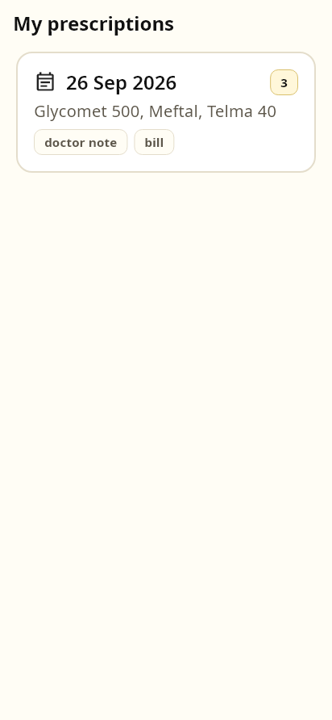 |

One `PrescriptionRecord` card per approved visit: date added, the medicine names it carried, and how
many.

### 7.4 The wizard — 8 steps

```dart
enum WizardStep { doctorWords, doctorTakeaways, photos, pharmacyWords,
                  chemistTakeaways, processing, medicines, placement }
```

Every step shows `step N of 8`, a **Back**, a **Next**, and — where it is honest to — a **Skip**.

#### Step 1 · doctorWords

| | |
|---|---|
| 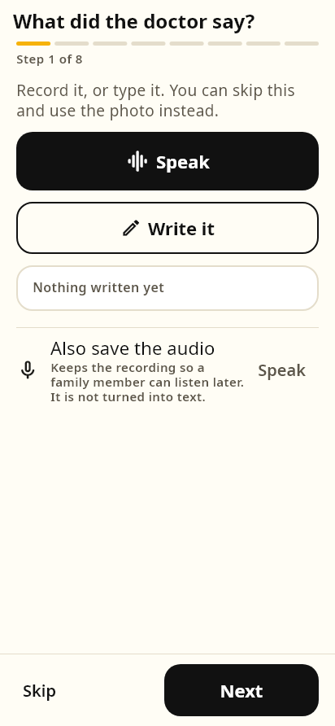 | 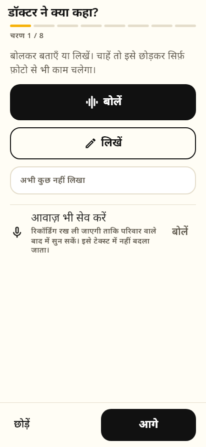 |

Anatomy:
- **Speak** — one primary mic button (there were briefly two; commit 21 fixed that). Live "listening" state, stop button.
- **Write instead** — opens `WriteNoteScreen`, a **full-page** writing window, then returns.
- **Also save the audio** — secondary, off by default.
- **Skip** — allowed; the prescription photo can carry the visit alone.

Dictation is `speech_to_text` with
`SpeechListenOptions(localeId: …, listenFor: 2min, pauseFor: 6s)`.

#### Step 2 · doctorTakeaways

| | |
|---|---|
|  | 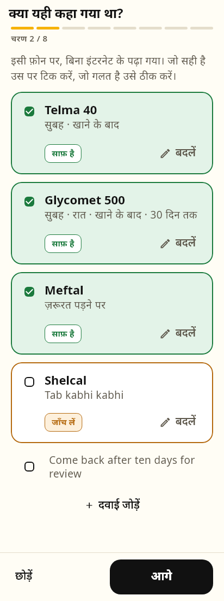 |

A **checkbox list** the human validates and edits. Rows are marked `looks clear` or `needs a check`.
Each row is editable: medicine name and instruction.

> This is the step the brief calls "offline LLM". It is **deterministic rules**, and the UI says so
> (ADR-25) — auditable, no hallucination, no quota, instant.

#### Step 3 · photos — one combined step


Three ways in — **Find recent photos**, **Camera**, **Gallery** — for the prescription, the bill and
the strips together (ADR-34).

```
scan gallery ──▶ read each photo on device (ML Kit) ──▶ label it
                         │
                         ▼
        ┌──────────────────────────────────────────┐
        │ [✓] Prescription   "Tab Telma 40 1-0-1"  │  ← evidence quoted
        │ [✓] Bill           "TELMA 40 30 NOS"     │
        │ [ ] Not medical    "beach 2024"  ⓘ why   │  ← unticked, reason shown
        └──────────────────────────────────────────┘
                   "Are these right?"  → Next
```

- Non-medical candidates arrive **unticked with the reason shown**, never hidden.
- **Only ticked photos** enter the visit, and only when the step is left. Scanning is an assistant, not an import.
- **OCR runs once** — the text read while labelling is reused by the extraction step. A test asserts exactly one read.
- Permission denied / unsupported platform is **reported on screen** with the manual pickers still live — never a dead button.

#### Step 4 · pharmacyWords — "Pharmacy page"

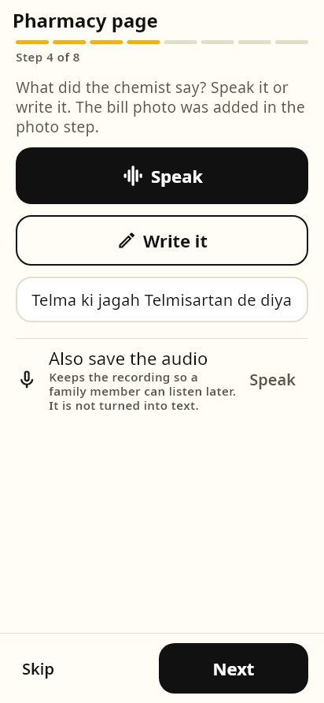

Renamed from "Pharmacy bill": it is the bill **plus** the chemist's note or voice note. Same
speak/write pattern as step 1.

#### Step 5 · chemistTakeaways

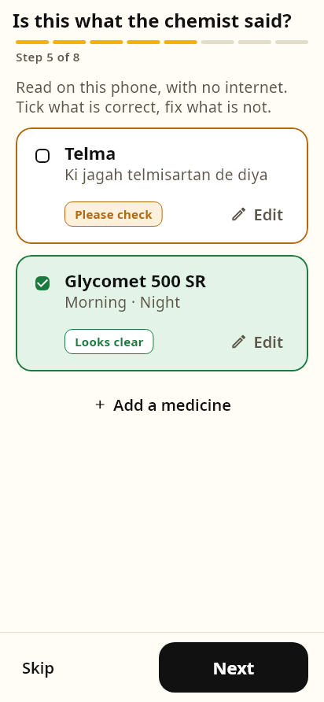

Same checkbox validation as step 2, for what the chemist said. **A substitution at the counter is
exactly the thing this catches** — "Telma ki jagah Telmisartan de diya" becomes a row a human ticks
or corrects, rather than a silent difference between the bill and the prescription.

#### Step 6 · processing


On-device: OCR text → `SigParser` → `MergeEngine`. Shows what it is doing (`judge`, `extract`,
`verify`) and an **"on device only"** badge. The screenshot above is the **offline** state, which is
what a judge should see first: the whole pipeline ran on the phone.

When **online**, one extra card appears:

```
┌────────────────────────────────────────────────┐
│  Read the handwriting online                   │
│  The prescription photo will be sent to Google │
│  to read the handwriting. Nothing else leaves  │
│  the phone.                          [ Read ]  │
└────────────────────────────────────────────────┘
```

Offline the card is **absent** — a button that cannot work is worse than no button.

#### Step 7 · medicines — the verification cards

| Cards | With source detail |
|---|---|
| 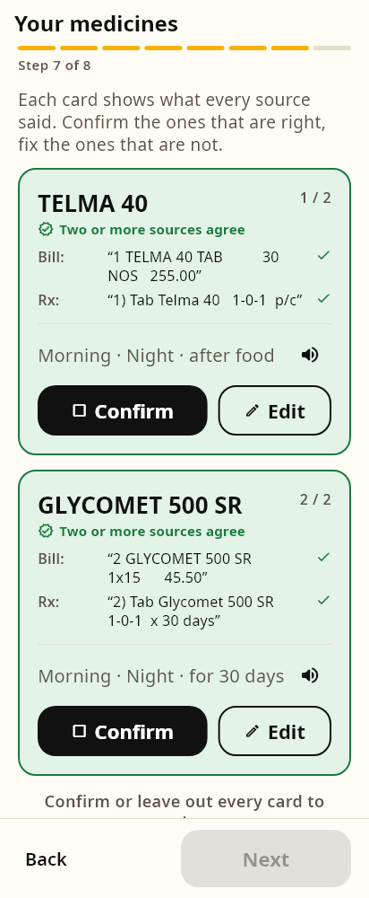 |  |

One card per medicine (the medical card from `docs/PLAN.md`):

```
┌─────────────────────────────────────────────┐
│ TELMA 40                             🟢     │
│ 1 in the morning, 1 at night · after food   │
│ ─────────────────────────────────────────── │
│ Bill      "TELMA 40 TAB  30 NOS"            │
│ Rx        "Tab Telma 40  1-0-1  p/c"        │
│ Doctor    "telma chalu rakhiye"             │
│ ─────────────────────────────────────────── │
│ Cross-checked · 3 sources agree             │
└─────────────────────────────────────────────┘
```

It shows **the evidence, not a claim** (ADR-31). A 🔴 row shows both conflicting readings side by
side and makes the human choose.

#### Step 8 · placement → approve


Where each new medicine sits next to what is already being taken, with a labelled reason:

| Reason | Meaning |
|---|---|
| `placementKept` | The prescription said when. **Not moving it.** |
| `placementSuggested` | Nobody said when — this is a **proposal** |
| `placementDuplicate` | Something with a very similar name is already on the schedule |
| `placementBusy` | This slot already carries several medicines |
| `placementFoodClash` | Empty-stomach medicine landing among after-food ones |
| `placementCourse` | Fixed duration; will stop on its own |

**Approve and add** → the medicines enter `MedicineStore`, and **two separate notifications** fire —
`Prescription saved` and `Schedule updated` — because they are **two different facts** (ADR-26).

### 7.5 Dose screen


```
┌───────────────────────────────────────┐
│ ○  TELMA 40                      🔊   │   ← tap the row to tick
│    [after food]  ●                    │   ← pictogram + one dot per tablet
├───────────────────────────────────────┤
│ ✓  GLYCOMET 500                  🔊   │   ← ticked: green fill, 3px border
│    [after food]  ● ●                  │
└───────────────────────────────────────┘
              1 / 2
   ┌─────────────────────────────────┐
   │   ✓  सब ले ली                    │   ← LOCKED until every row is ticked
   └─────────────────────────────────┘
```

**Two gates on purpose.** Per-medicine ticks stop a half-finished slot being logged as done; the
final button is the single confirmation the caregiver's phone hears about. `allTakenButton` =
`All taken` / **`सब ले ली`**.

Confirming: writes the log → pops → **then**, not awaited before the pop, fires the caregiver alert
and cancels that slot's reminders. A slow network must never hold the screen open.

### 7.6 Schedule screen

| English | Hindi |
|---|---|
|  | 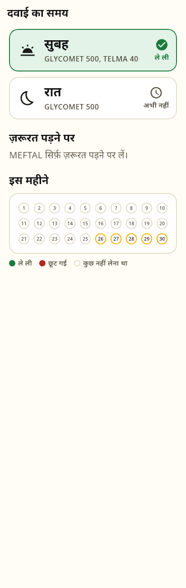 |

- One card per **due** slot with live status. Empty slots are not shown — an empty "Afternoon" row is noise for someone taking two tablets a day.
- Status words: `Taken`/`ले ली` · `Missed`/`छूट गई` · `Not yet`/`अभी नहीं` · `Due now`/`अभी का समय`
- **When needed** section for SOS medicines
- **Month calendar** — green taken, red missed, hollow still to come, faint for a day with nothing due
- **Share** action in the app bar
- A banner when reminders cannot run
- On open: checks for missed doses **and** re-syncs reminders

### 7.7 Caregiver home

| Empty | Populated | Hindi |
|---|---|---|
| 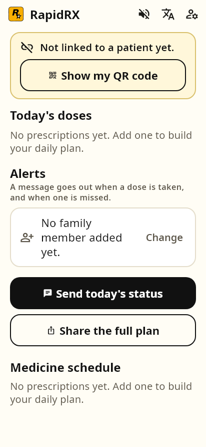 |  | 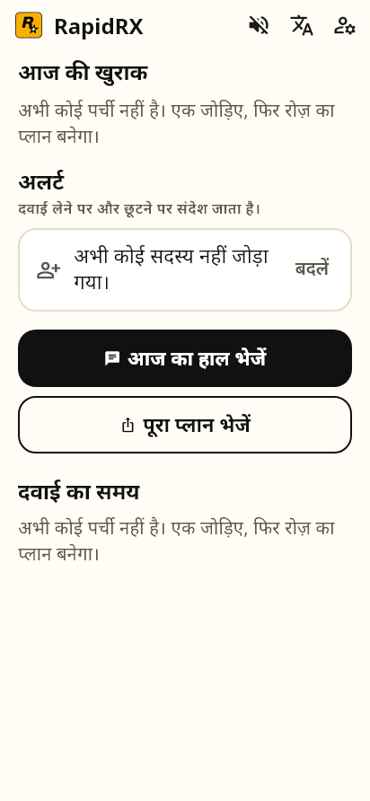 |

```
Today's doses
┌──────────┐ ┌──────────┐
│    ✓     │ │    🕐    │      ← one pill per due slot, live status
│ Morning  │ │  Night   │
└──────────┘ └──────────┘

Alerts
A message goes out when a dose is taken, and when one is missed.
┌──────────────────────────────────────────────┐
│ 👤  +91 9876543210                  Change   │  ← green when set
└──────────────────────────────────────────────┘

[ 💬  Send today's status ]     ← primary, WhatsApp
[ ⬆   Share the full plan  ]     ← secondary, any app

Medicine schedule
• Take TELMA 40 in the morning, after food. The doctor said this is for "BP".
• Take GLYCOMET 500 in the morning and at night, after food, for 30 more days.
```

---

## 8. Data, storage and backend

### 8.1 What is actually wired — say this honestly

**There is no Firebase in this build.** Everything persists locally through `shared_preferences` as
JSON. `minSdk = 24` is set for the Firebase + ML Kit floor, and ADR-6 plans Firestore with an offline
cache for medical data — but the hackathon build ships local-only. That is a deliberate, documented
shortcut, not an oversight.

| Key | Holds | Owner |
|---|---|---|
| `app_role` | `patient` / `caregiver` | `AppPrefs` |
| `app_language` | `en` / `hi` | `AppPrefs` |
| `voice_help` | bool | `AppPrefs` |
| `phone_number`, `user_name`, `backup_phone` | identity | `AppPrefs` |
| `pin_hash` | SHA-256 of the PIN | `AppPrefs` |
| `scheduled_medicines` | JSON list | `MedicineStore` |
| `prescription_records` | JSON list | `MedicineStore` |
| `dose_logs` | JSON list | `DoseLogStore` |
| `visit_draft` | the in-progress visit | `VisitRepository` |
| `rapidrx.alerts.sent` | alert dedupe keys (last 60) | `CaregiverNotifier` |
| alert outbox | queued alerts that could not send | `AlertOutbox` |

Photos and audio are **files**, not preferences: `MediaStore` writes them into the app documents
directory, one folder per visit, and only paths go into the draft. **A visit is saved after every
capture, not at the end** (ADR-20) — an app killed mid-visit loses nothing.

### 8.2 Exact JSON schemas

```jsonc
// scheduled_medicines — List<ScheduledMedicine>
{
  "id": "telma-40",
  "name": "TELMA 40",          // English letters, exactly as printed
  "strength": "40mg",          // omitted when null
  "sig": {
    "slots": ["morning", "night"],   // morning|afternoon|evening|night
    "food": "after",                 // before|after|unspecified
    "everyNDays": 2,                 // omitted when null
    "sos": true,                     // omitted when false
    "stat": true,                    // omitted when false
    "durationDays": 30,              // omitted when null
    "unitsPerDose": 1.0,             // 1, 2, or 0.5 for "half"
    "unresolved": ["aur"]            // non-empty ⇒ ask a human
  },
  "startDate": "2026-09-26T00:00:00.000",
  "active": true,
  "purpose": "for BP"          // quoted from the doctor, NEVER inferred
}
```

```jsonc
// prescription_records
{ "id": "v1", "addedAt": "2026-09-26T09:30:00.000",
  "medicineNames": ["TELMA 40", "GLYCOMET 500"] }

// dose_logs
{ "date": "2026-09-26T00:00:00.000", "slot": "morning", "status": "taken",
  "confirmedAt": "2026-09-26T08:10:00.000", "taken": ["telma-40"] }
```

### 8.3 Platform-split pattern — use it for every native capability

```dart
import 'x_stub.dart' if (dart.library.io) 'x_io.dart' as platform;

abstract class X {
  factory X() => platform.createX();
}
```

| Interface | Mobile | Elsewhere |
|---|---|---|
| `TextRecogniser` | ML Kit (Latin + Devanagari) | Honest "this build cannot read photos" |
| `MediaStore` | Files in documents dir | In-memory / blob URLs |
| `VoiceCache` | WAV files in app support | Memory |
| `GalleryScanner` | `photo_manager` | `ScanOutcome.unsupported` |
| `DoseReminders` | `flutter_local_notifications` | `ReminderStatus.unsupported` |

**The stub never fakes success.** It reports why it cannot do the thing and the UI says so. A silent
empty result is indistinguishable from "your bill was blank" — the worst failure mode in this product.

### 8.4 The one hard codebase rule

**Never construct an external resource in a constructor.** `AudioPlayer()`, `http.Client()`, ML Kit
recognisers all touch platform channels, and a constructor that does so breaks `flutter_test` at
*load* time with `There is no current invoker`.

```dart
final http.Client? _injected;
http.Client? _lazy;
http.Client get _http => _injected ?? (_lazy ??= http.Client());
```

The injected field is also every test's seam for a `MockClient`.

### 8.5 Outbound network calls — the complete list

Everything not on this list is on-device.

#### Gemini

```http
POST https://generativelanguage.googleapis.com/v1beta/models/gemini-3.8-flash:generateContent?key=…
Content-Type: application/json
```
```jsonc
{
  "contents": [{ "parts": [
    { "text": "<the prompt>" },
    { "inline_data": { "mime_type": "image/jpeg", "data": "<base64>" } }
  ]}],
  "generationConfig": { "temperature": 0, "responseMimeType": "application/json" }
}
```
Response is unwrapped from `candidates[0].content.parts[*].text`, ``` fences stripped, then:
```jsonc
{ "medicines": [ { "name": "", "strength": "", "instruction": "", "raw": "", "uncertain": false } ],
  "notes": [ "" ] }
```

#### Kokoro TTS

```http
POST https://leonelhs-kokoro-tts-hindi.hf.space/gradio_api/call/predict
{ "data": ["<text>", "hf_alpha", 1.0] }        → { "event_id": "…" }

GET  …/gradio_api/call/predict/<event_id>       → SSE stream carrying the audio URL
GET  <audio url>                                → WAV bytes → cached on device
```

#### Twilio

```http
POST https://api.twilio.com/2010-04-01/Accounts/<sid>/Messages.json
Authorization: Basic base64(sid:token)
Content-Type: application/x-www-form-urlencoded

From=whatsapp:+14155238886&To=whatsapp:+919876543210&Body=<message>
```

#### WhatsApp deep link (no credentials needed)

```
https://wa.me/919876543210?text=<url-encoded message>
```

---

## 9. Extraction pipeline

### 9.1 Source trust order — the heart of the product (plan D6)

| Question | Order |
|---|---|
| **What** the medicine is (identity) | **bill > strip > doctor's words > prescription photo** |
| **When** to take it (timing) | **doctor's words > prescription > chemist** |

A pharmacy bill is *printed*, and OCR reads printed text at **over 99%** where frontier models manage
**55–58%** on handwriting. So the bill decides identity — and it costs nothing: no network, no key,
no quota. The doctor decides timing, because the bill carries none.

### 9.2 `SigParser` — shorthand to structure, in code

Deterministic, auditable, no model. Handles:

| Input | Meaning |
|---|---|
| `OD` `BD` `TDS` `QID` | once / twice / thrice / four times daily |
| `HS`, `nocte` | at night |
| `1-0-1`, `1-1-1`, `0-0-1` | positional slots |
| `a/c` · `p/c` | before food · after food |
| `SOS` | **as needed — no slots, no alarm ever** (an alarm would be inventing a time) |
| `STAT` | a single dose, now |
| `x 10 days`, alternate days | duration, every-N-days |
| `subah ek`, `do`, `teen`, `khane ke baad` | Hindi / Hinglish and spoken quantities |

> ### ⚠ Four parser bugs the cross-check tests forced out (ADR-30) — build the fixes in
> 1. `TELMA 40 TAB` read as **40 tablets** → cap single-digit units
> 2. Bill quantities landing in names (`30 NOS`) → cutter
> 3. Double-space column artefacts in names → cutter
> 4. `aur` ("and") flagging clean rows → connectors added to ignorables; Hindi/English number words added

### 9.3 `ContentGate` — guardrails on every input (ADR-33)

```dart
enum ContentKind { prescription, bill, medicineStrip, medicalOther, notMedical }
```

Two-tier scoring:

| Tier | Signals |
|---|---|
| **Strong** | dosage forms (`TAB`, `CAP`, `SYP`), shorthand (`BD`, `1-0-1`, `p/c`), dose patterns, strengths (`40mg`) |
| **Weak** | supporting markers that **cannot carry a verdict alone** |

A brand name plus a number only **supports** existing evidence — it never establishes it.

**Never silent, never final.** The words that caused the verdict come back with it and are shown, and
every rejection offers **"use it anyway"**. A gate that quietly discarded a real prescription would
be worse than no gate.

**The bar is deliberately lower for speech than for photos** — "Telma forty, one in the morning" is
one short sentence, and demanding several signals would reject real instructions all day.

> ### ⚠ Three tuning bugs the first version shipped with
> `TOTAL` and `night` counted as medical evidence, so a **café receipt** and a **cricket
> conversation** both passed; and word-plus-number matched **"beach 2024"**. Write the strong/weak
> split from the start.

### 9.4 `GeminiClient` — the only cloud call (ADR-35)

| Setting | Value |
|---|---|
| Handwriting model | `gemini-3.8-flash` |
| Audio model | `gemini-3.5-flash-lite` |
| `temperature` | `0` — the same photo must not produce a different list on the second run mid-demo |
| `responseMimeType` | `application/json` |
| Budget | **4 calls per visit**, hard cap |
| Timeout | 45s |

The prompt does more work than the model choice:
- Names in **English letters exactly as written**, so they cross-check against the bill
- The form word left out — `Tab Telma 40` → `Telma 40`
- An **`uncertain` flag demanded instead of a confident guess** — a missing field is far better than a wrong one, because a human checks every row either way
- Non-medicine instructions go to `notes`
- If nothing can be read: return empty, do not guess

**The model gets no extra trust.** Its rows land in the same merge engine, against the same printed
sources, at the same 🟢🟡🔴 card. Online is a better *reader*, not a higher *authority*.

---

## 10. The merge engine

Plain Dart, deterministic, inspectable, identical every run — this is the step that decides what
reaches a patient's schedule, so **no model sits between the evidence and the plan** (ADR-23).

```
doctor's words ─┐
prescription  ──┤
bill          ──┼──▶ group by name (NameMatcher, similarity ≥ 0.86)
strip         ──┤         │
chemist       ──┘         ▼
                    compare slots + food + interval across sources
                          │
             ┌────────────┼────────────┐
             ▼            ▼            ▼
          🟢 green     🟡 amber      🔴 red
        all agree    thin / single   they disagree —
                       source        BOTH kept, human decides
```

- Two mentions from the **same** source stay apart — a bill can legitimately list a brand twice, and merging them would hide a duplicate.
- **Duration differences are not a conflict** — a doctor saying "for a month" and a bill covering ten days is normal.
- Conflicts are **kept**, never resolved silently (plan D7).

> ### Rule change worth knowing
> "Timing from a single source" originally blocked green. But a bill carries **no timing at all**,
> which made green unreachable even with the best possible evidence present. The rule was dropped and
> the test updated with the reasoning.

---

## 11. Schedule, doses and reminders

### 11.1 `DoseClock`

```dart
nominalHour = { morning: 8, afternoon: 14, evening: 18, night: 21 }
remindAgainAfter = Duration(minutes: 30)
missedAfter      = Duration(minutes: 60)
```

Nominal times drive **reminders only** — the patient still sees सुबह / दोपहर / रात.
**Forty minutes late is late, not missed:** crying wolf is how a family learns to ignore alerts.

```
 08:00 ──────── 08:30 ──────── 09:00 ──────────▶
 due            nudge          missed
 (alarm 1)      (alarm 2)      (caregiver told; patient NOT alarmed again)
```

### 11.2 `DoseLogStore` — missed is derived, not written

Nothing is running at 09:01 to record a miss, so status is computed whenever it is asked for.

> ### ⚠ The bug that hid every missed dose
> `statusOf(now, date, slot)` compared a **timestamped** `date` against midnight, so a same-day slot
> always returned `pending` and **missed doses never appeared on the schedule screen at all**. Both
> callers pass `DateTime.now()`. Compare **day to day**.

### 11.3 `PlacementAdvisor` — two rules keep it safe

1. **A timing the doctor gave is never moved.** If the prescription says 1-0-1, it stays 1-0-1. "Optimising" a prescribed schedule is exactly the kind of help that gets someone hurt, and is outside PS-01's scope (no dose changes).
2. **A timing nobody gave is a suggestion, and is labelled as one**, so approve is a real decision rather than a rubber stamp.

### 11.4 `ReminderPlanner` + `DoseReminders` (ADR-37)

**Two notifications per due slot, then silence.** A third alarm is how a family learns to swipe the
app away; by +60 the slot counts as missed and it is the **caregiver** who is told. The escalation
moves to a different person rather than getting louder.

- **Exact alarms** — an inexact one can drift by hours, and a tablet due with breakfast reminded at 2pm is the same as no reminder. If the permission is refused: schedule an **inexact** alarm rather than nothing
- **Ids derived from the slot**: `slot.index * 2 + (nudge ? 1 : 0)` — never random, so a re-sync replaces instead of duplicating
- **Every sync is a full replace** — a stale alarm in the wrong language for a medicine stopped last week is worse than a missing one
- Confirming a dose **cancels that slot immediately**, so the +30 nudge never fires for a dose already taken
- **Never rings for**: an SOS medicine, a finished course, a stopped medicine, or a slot already taken
- When reminders cannot run at all, **the screen says so** — an alarm that silently never fires is the worst outcome, because the patient believes it is handled

The planning logic is a **pure class with no plugin**, so all of it is testable on a laptop. Only the
handoff to the OS is platform code.

---

## 12. Caregiver, sharing and WhatsApp

### 12.1 Plain text, not an app to install (ADR-36)

The daughter in another city has WhatsApp and five minutes. Asking her to install an app, create an
account and pair a device to find out whether her father took his tablets is how a feature goes
unused. Text arrives, reads on any phone, forwards to a doctor, and **pastes into SMS** when the
caregiver has no smartphone at all.

`PlanSummary` produces three messages:

```
Medicine plan — Ramesh                 │  Medicines today — Ramesh
                                       │  26/09/2026
• Take TELMA 40 in the morning, after  │
  food. The doctor said this is for    │  Morning: Taken — TELMA 40, GLYCOMET 500
  "BP".                                │  Night: Not yet — GLYCOMET 500
• Take GLYCOMET 500 in the morning and │
  at night, after food, for 30 more    │  ── and the one-line alert:
  days.                                │  Ramesh: Morning medicines were missed.
                                       │
Sent from RapidRX. Every row was       │
checked by a person. This is not       │
medical advice.                        │
```

Medicine names stay in **English letters in the Hindi message too** — the person reading it may be
the one holding the strip, and the strip says TELMA.

### 12.2 Two delivery paths, and the UI says which happened

```dart
enum AlertDelivery { sentAutomatically, openedInWhatsApp, failed }
```

| Path | When | Why |
|---|---|---|
| **Twilio** | Credentials configured | Sends itself. A *missed* dose needs this — the patient has not done anything, so there is nobody to press send |
| **`wa.me` deep link** | Otherwise | WhatsApp opens with the message ready; a human presses send. For *sharing* a plan this is arguably correct, not degraded |

The screen never claims a message was delivered when it was only drafted.

### 12.3 `CaregiverNotifier` — when the family is told

- **Automatic-only** for dose events. It never falls back to the deep link: hijacking the patient's screen to open WhatsApp the moment they tick "सब ले ली" would be worse than no alert
- **Once per slot per day**, keyed `date/slot/kind` and stored, so reopening the app does not re-announce a dose missed three hours ago
- **Missed doses are found when a schedule screen opens**, not at the minute they happen. The message therefore names the slot and the day rather than implying "right now"

### 12.4 `AlertOutbox` — an alert with no signal is not lost

A failed send is written down under the same dedupe key and drained the next time the app has reason
to reach the network. The key is remembered **at queue time**, so a queued alert is never also sent
fresh. Only **retryable** failures queue — a bad number or a rejected message is permanent, and
queuing it would retry forever.

### 12.5 Phone numbers

`WhatsAppAlerts.normalise()`:

| Input | Output |
|---|---|
| `9876543210` | `+919876543210` |
| `98765 - 43210` | `+919876543210` |
| `919876543210` | `+919876543210` |
| `+919876543210` | unchanged |
| `98765`, `""`, `not a number` | **`null`** — a typo becomes a visible error, not a message to nobody |

---

## 13. The voice agent — Twilio calls

> **Status: designed, not built.** Everything in this section is specified to the point where it can
> be implemented in a sitting, and the pieces it plugs into — `CaregiverNotifier`, the dedupe keys,
> `AlertOutbox`, the Kokoro cache — already exist. Nothing here is running yet. Say that plainly
> rather than letting a judge discover it.

### 13.1 Why a phone call earns its place

RapidRX already has two outbound channels. Both assume something about the person:

| Channel | Assumes |
|---|---|
| Local notification | The patient has the app, on this phone, and looks at the screen |
| WhatsApp | The **caregiver** has a smartphone and WhatsApp |

Neither reaches **the patient who cannot read, does not use WhatsApp, or is on a feature phone** —
which is a large part of the population PS-01 is about. A ringing phone is the only channel that
interrupts, needs no literacy, needs no app, and works on a ₹1,200 handset.

So the ladder is:

```
  dose due ──▶ local notification (8:00, and a nudge at 8:30)
                     │  still nothing at +60
                     ▼
              caregiver WhatsApp alert  ── "Morning medicines were missed"
                     │  no caregiver number, OR caregiver asks for it
                     ▼
              📞 VOICE CALL to the patient
                     │  no answer / no keypress, twice
                     ▼
              caregiver is told the call was not answered
```

**The call is the last rung, not the first.** Phoning someone about a tablet they took ten minutes
ago is how a family unplugs the phone.

### 13.2 What the agent does — two directions

**A · Outbound — the missed-dose call.** RapidRX rings the patient, says in their language which
medicines are due, and asks them to press a key. The keypress writes back to the dose log, so
answering the phone is a real confirmation, not a reminder that vanishes.

**B · Inbound — "what do I take now?"** The patient calls the RapidRX number from any phone. The
agent reads today's plan aloud. This is the whole app, over a phone line, for someone who never
opens it — and it is the demo moment: **hang up the smartphone, call from a feature phone, hear the
same schedule.**

### 13.3 Call flow

```
 ┌── OUTBOUND ────────────────────────────────────────────────────────────────┐
 │                                                                            │
 │  POST /Calls.json  ──▶  Twilio rings the patient                           │
 │                              │ answered                                     │
 │                              ▼                                              │
 │   GET  /voice/dose?patient=…&slot=morning                                   │
 │        <Play> "Namaste. RapidRX se. Subah ki dawai ka samay ho gaya:        │
 │                TELMA 40, GLYCOMET 500."                                     │
 │        <Gather numDigits=1 timeout=8>                                       │
 │          "Le li hai to 1 dabaiye. Abhi nahi to 2. Madad chahiye to 9."      │
 │                              │                                              │
 │        ┌─────────────────────┼─────────────────────┐                        │
 │        ▼ 1                   ▼ 2                   ▼ 9                      │
 │   log TAKEN             log still due          tell caregiver               │
 │   "Shukriya."           "Theek hai, 15        "Aapke gharwaalon ko          │
 │   hang up                minute baad phir      bata diya gaya hai."         │
 │                          yaad dilayenge."      hang up                      │
 │                              │                                              │
 │        ▼ no keypress (repeat the <Gather> once, then)                       │
 │   "Koi baat nahi." → hang up → caregiver told the call went unanswered      │
 └────────────────────────────────────────────────────────────────────────────┘

 ┌── INBOUND ─────────────────────────────────────────────────────────────────┐
 │  patient dials the RapidRX number                                          │
 │   POST /voice/inbound   (caller id → which patient)                        │
 │        <Play> "Namaste. Aaj ki dawai sunne ke liye 1 dabaiye.              │
 │                Agli dawai ka samay jaanne ke liye 2."                      │
 │     1 ▶ reads the full day, slot by slot                                    │
 │     2 ▶ "Agli dawai raat 9 baje: GLYCOMET 500, khane ke baad."             │
 │     unknown caller ▶ "Yeh number RapidRX me darj nahi hai." → hang up       │
 └────────────────────────────────────────────────────────────────────────────┘
```

### 13.4 Keypad, not speech recognition

The confirmation is **DTMF only**. This is a deliberate refusal of the more impressive option.

- The caller is elderly, often in a noisy room, frequently with a regional accent and sometimes hard of hearing. ASR on that audio is exactly where it is weakest.
- A misheard "*nahi*" logged as **taken** is a silent false record in a medical log — the single worst failure this product can produce. A keypress cannot be misheard.
- It is also cheaper, has no recognition latency, and works on a line with bad reception.

A `<Gather input="speech dtmf">` free-speech path for the *inbound* "what do I take now" question is
a reasonable **phase 2**, because a misunderstanding there is harmless — it reads the plan back
instead of writing to it. It is not phase 1.

### 13.5 The voice itself — Kokoro, not Twilio `<Say>`

The app already speaks with Kokoro, and the phone should be the same voice — a different, worse
voice on the call makes it sound like a robocall from someone else.

```
sentence ──▶ Kokoro cache (§14) ──▶ WAV ──▶ hosted at a public URL ──▶ <Play>
                    │ miss, or Space asleep
                    ▼
            <Say language="hi-IN"> …fallback, still understandable…
```

The medicine names stay in **English letters in the text**, and Kokoro pronounces them as written —
the same rule as everywhere else (plan D13), because the patient is matching what they hear against
the strip in their hand.

**Pre-generate the fixed phrases the night before** ("Namaste, RapidRX se…", the keypad prompt, the
thank-you). Only the medicine list varies per call, and that is one short sentence.

### 13.6 What the agent will never do

Guardrails, in the same spirit as the content gate — and these matter more on a phone call, because
there is no screen to qualify anything.

1. **It never gives medical advice.** It reads back what a human already approved. No dose changes, no substitutions, no "you can skip it today".
2. **It never says why a medicine was prescribed** unless the doctor's own words were captured, and then it quotes them as a quote — the same rule the cards follow.
3. **It identifies itself immediately**: "RapidRX se, yeh ek automatic call hai." Nobody should think a pharmacist is on the line.
4. **It never claims to be a medical or emergency service.** Pressing 9 tells the **caregiver**; it does not call an ambulance, and it does not say it will.
5. **No calls between 22:00 and 07:00**, ever. A night-slot miss waits for the morning.
6. **At most one call per slot per day**, reusing the existing `date/slot/kind` dedupe key, so a crash loop cannot phone someone eleven times.
7. **It hangs up gracefully.** Two unanswered `<Gather>`s and the call ends politely; the caregiver is told it was not answered.
8. **The call is opt-in**, chosen during onboarding alongside voice help, and can be turned off from the same place.

### 13.7 The honest part: this needs a backend

**This is the first thing in RapidRX that is genuinely not offline-first, and it should be labelled
as such rather than blurred.** Twilio has to reach a public HTTPS webhook when a call connects;
a phone in someone's pocket cannot serve one.

| Option | When |
|---|---|
| **Firebase Cloud Functions** | The real answer. It is already the direction of ADR-6, and the same project would hold Firestore |
| **A small Node/Express service + ngrok** | The hackathon answer. Twenty minutes, one tunnel, one `TWILIO_VOICE_URL` |

What the backend must hold, at minimum:

```jsonc
// one document per patient the agent may call
{ "patientId": "p1", "phone": "+919876543210", "language": "hi",
  "caregiverPhone": "+919812345678",
  "plan": [ { "slot": "morning", "medicines": ["TELMA 40", "GLYCOMET 500"] },
            { "slot": "night",   "medicines": ["GLYCOMET 500"] } ],
  "today": { "morning": "pending", "night": "pending" } }
```

**The dose log stays owned by the phone.** The webhook writes the keypress into this shared record;
the app reconciles it on next open, exactly as it already reconciles missed doses. If the two ever
disagree, **the phone wins for "taken" and the call wins for nothing** — a confirmation should never
be undone by a webhook replay.

### 13.8 Endpoints and TwiML

```
POST /voice/dose          call connected  → the prompt + <Gather>
POST /voice/dose-response <Gather> action → log the keypress, speak the reply
POST /voice/inbound       inbound call    → identify the caller, offer the menu
POST /voice/inbound-menu  <Gather> action → read the day, or the next slot
POST /voice/status        Twilio status   → no-answer / busy / failed → tell the caregiver
```

```xml
<!-- POST /voice/dose -->
<Response>
  <Play>https://…/audio/hi/greeting.wav</Play>
  <Play>https://…/audio/hi/call_a1b2c3.wav</Play>          <!-- the medicine list -->
  <Gather numDigits="1" timeout="8" action="/voice/dose-response" method="POST">
    <Play>https://…/audio/hi/keypad_prompt.wav</Play>
  </Gather>
  <!-- falls through when nothing is pressed -->
  <Redirect method="POST">/voice/dose?attempt=2</Redirect>
</Response>
```

```xml
<!-- POST /voice/dose-response , Digits=1 -->
<Response>
  <Play>https://…/audio/hi/thank_you.wav</Play>
  <Hangup/>
</Response>
```

Every webhook must **validate the `X-Twilio-Signature` header** against the auth token. An unsigned
POST to a public URL could otherwise write a false "taken" into someone's medical log.

### 13.9 Placing the call

Same account, same Basic auth, same credentials as the WhatsApp messages — one `TWILIO_*` set:

```http
POST https://api.twilio.com/2010-04-01/Accounts/<sid>/Calls.json
Authorization: Basic base64(sid:token)
Content-Type: application/x-www-form-urlencoded

To=%2B919876543210&From=%2B15551234567
&Url=https%3A%2F%2F…%2Fvoice%2Fdose%3Fpatient%3Dp1%26slot%3Dmorning
&StatusCallback=https%3A%2F%2F…%2Fvoice%2Fstatus
&Timeout=25&MachineDetection=Enable
```

`MachineDetection=Enable` so a voicemail box is not treated as a person who declined to press a key.

### 13.10 Dart side — `VoiceCallChannel`

It slots in beside `WhatsAppAlerts`, behind the same notifier, and inherits the dedupe and the
outbox for free:

```dart
enum CallOutcome { placed, notConfigured, outsideCallingHours, alreadyCalled, failed }

class VoiceCallChannel {
  VoiceCallChannel({http.Client? client, this.accountSid = const String.fromEnvironment('TWILIO_ACCOUNT_SID'),
                    this.authToken  = const String.fromEnvironment('TWILIO_AUTH_TOKEN'),
                    this.fromNumber = const String.fromEnvironment('TWILIO_CALL_FROM'),
                    this.webhookBase = const String.fromEnvironment('TWILIO_VOICE_URL')})
      : _injected = client;

  bool get isConfigured => accountSid.isNotEmpty && webhookBase.isNotEmpty;

  /// 07:00–22:00 only. A reminder is not worth waking someone for.
  static bool withinCallingHours(DateTime at) => at.hour >= 7 && at.hour < 22;

  Future<CallOutcome> callAboutSlot({
    required String phone, required DoseSlot slot, required String patientId,
  });
}
```

In `CaregiverNotifier`, the escalation becomes one extra rung:

```dart
// …after the WhatsApp alert for a missed slot
if (calls.isConfigured && prefs.voiceCallsEnabled &&
    VoiceCallChannel.withinCallingHours(at) && !await _alreadySent(callKey)) {
  final outcome = await calls.callAboutSlot(phone: patientPhone, slot: slot, patientId: id);
  if (outcome == CallOutcome.placed) await _remember(callKey);
}
```

### 13.11 Cost, trial limits and the thing that will bite on the day

- **A Twilio trial account can only call numbers you have verified.** Verify **both demo phones the night before** — this is the failure that ends a live demo, and it cannot be fixed from the stage.
- A trial call also plays Twilio's own "this is a trial account" preamble before your TwiML. Know it is coming so it does not look like a bug.
- Indian voice termination is billed per minute. **Keep a call under ~45 seconds** — which the script already does.
- Put a **hard cap of ~20 calls per day** next to the per-slot dedupe. A bug that dials in a loop burns real money and real goodwill.
- An Indian `From` number needs regulatory paperwork. For the demo, a **US Twilio number calling an Indian mobile** works and needs none.

### 13.12 How to demo it without waiting for a real miss

Add a debug action behind `DevFlags`: **"Call me about this slot now."** It places the real call,
through the real webhook, with the real audio — it only skips the "wait an hour for a dose to be
missed" part. Set a slot's nominal hour to two minutes ahead if you want the genuine path.

### 13.13 Testing it

The same split as the reminders: the decision is pure and testable on a laptop, only the handoff is
not.

| Test | Covers |
|---|---|
| `withinCallingHours` | 06:59 no, 07:00 yes, 21:59 yes, 22:00 no |
| TwiML generation | A pure `String buildDoseTwiml(...)` → assert the XML, both languages |
| Keypress handling | `1` logs taken, `2` does not, `9` alerts the caregiver, unknown digit re-prompts |
| The escalation | A missed slot with no caregiver number still calls; a slot already taken never calls |
| Dedupe | Two runs place one call |
| `MockClient` on `Calls.json` | `To`, `From`, `Url` and the Basic auth header |
| Signature validation | A POST with a bad `X-Twilio-Signature` is rejected |

---

## 14. Voice — Kokoro TTS (ADR-32)

Device TTS was robotic, had no usable Hindi voice, and read the wrong screen. Recorded MP3s per page
were replaced entirely.

| | |
|---|---|
| Space | `https://leonelhs-kokoro-tts-hindi.hf.space` |
| Voices | `hf_alpha` (female), `hm_omega` (male) |
| Cache | per **sentence**, keyed `cacheKey(text, language, speed)`; WAV on device, memory on web |
| Fallback chain | Kokoro → device TTS → **silence** |
| Failure policy | one failure marks the Space unreachable for the session |

After one warm walkthrough the voice works **offline**.

> ### ⚠ Two traps
> 1. `getLanguages()` returns empty on the first web call, which made the app report "no voice"
>    incorrectly. Consult `getLanguages` **and** `getVoices`, and retry optimistically.
> 2. If the Space is asleep the first request takes **~30 seconds**. Warm the cache early.

---

## 15. Android configuration

### 15.1 `android/app/build.gradle.kts`

```kotlin
minSdk = 24                                  // Firebase + ML Kit floor; ~97% of Indian devices
sourceCompatibility = JavaVersion.VERSION_17
targetCompatibility = JavaVersion.VERSION_17
isCoreLibraryDesugaringEnabled = true        // required by flutter_local_notifications

buildTypes { release { proguardFiles(
    getDefaultProguardFile("proguard-android-optimize.txt"), "proguard-rules.pro") } }

dependencies { coreLibraryDesugaring("com.android.tools:desugar_jdk_libs:2.1.4") }
```

Without desugaring:
`Dependency ':flutter_local_notifications' requires core library desugaring to be enabled`.

### 15.2 `proguard-rules.pro` — the release-build trap

ML Kit Text Recognition ships one artifact per script. The Flutter plugin references all five; this
app depends on Latin and Devanagari only, so **R8 finds the other three missing and fails the release
build**:

```proguard
-dontwarn com.google.mlkit.vision.text.chinese.**
-dontwarn com.google.mlkit.vision.text.japanese.**
-dontwarn com.google.mlkit.vision.text.korean.**
```

### 15.3 `AndroidManifest.xml`

```xml
<uses-permission android:name="android.permission.RECORD_AUDIO"/>
<uses-permission android:name="android.permission.CAMERA"/>
<uses-feature android:name="android.hardware.camera" android:required="false"/>
<uses-permission android:name="android.permission.READ_MEDIA_IMAGES"/>
<uses-permission android:name="android.permission.READ_EXTERNAL_STORAGE" android:maxSdkVersion="32"/>

<uses-permission android:name="android.permission.POST_NOTIFICATIONS"/>
<uses-permission android:name="android.permission.SCHEDULE_EXACT_ALARM"/>
<uses-permission android:name="android.permission.USE_EXACT_ALARM"/>
<uses-permission android:name="android.permission.RECEIVE_BOOT_COMPLETED"/>
<uses-permission android:name="android.permission.VIBRATE"/>
```

Plus the two plugin receivers inside `<application>`: `ScheduledNotificationReceiver`, and
`ScheduledNotificationBootReceiver` with intent filters for `BOOT_COMPLETED`, `MY_PACKAGE_REPLACED`,
`QUICKBOOT_POWERON` and the HTC variant — a phone that reboots overnight must still ring at 8am.

---

## 16. Secrets and tooling

### 16.1 Secrets

The repository is **public**. No key is ever committed.

`tools/keys.example.ps1` (committed) → copy to `tools/keys.local.ps1` (**gitignored**):

```powershell
$env:GEMINI_API_KEY = "paste-key-here"
$env:TWILIO_ACCOUNT_SID = ""
$env:TWILIO_AUTH_TOKEN = ""
$env:TWILIO_WHATSAPP_FROM = ""
```

The scripts pass them as `--dart-define`; `AiConfig` and `WhatsAppAlerts` read them with
`String.fromEnvironment`.

> **Say this out loud rather than hiding it:** a key passed by `--dart-define` is still embedded in
> the APK and extractable from it. It is a key you are willing to **rotate after the event**. Plan
> D18 — proxying through Firebase AI Logic with App Check — is the real fix and is not hackathon work.

### 16.2 Tooling

| Script | Does |
|---|---|
| `tools/run.ps1` | Loads keys, then `flutter run` / `flutter build` with all four `--dart-define`s. `-Device chrome`, `-Build apk` |
| `tools/web.ps1` | Builds the web release with keys and serves on localhost:8080. `-NoBuild` serves instantly |
| `tools/serve.js` | Plain static file server |
| `tools/keys.example.ps1` | The template above |

```bash
.\tools\web.ps1
```

```bash
.\tools\run.ps1 -Build apk
```

> ### ⚠ The single biggest time-waster
> `flutter build web --release` installs a service worker that caches the whole app and serves the
> **stale** build after a rebuild. Your fix looks like it did nothing. Always build with
> `--pwa-strategy=none` (already in `web.ps1`). **When something looks like a no-op, suspect this
> first.**
>
> Also: `flutter run -d web-server` serves a **blank page** (a DWDS websocket problem). Build a
> release and serve it statically — which is what `web.ps1` does.

---

## 17. Testing strategy

**273 tests.** The verification approach is a large part of why this rebuilds quickly.

### 17.1 Golden screenshots are the primary UI check

Screens cannot be photographed reliably — `PrintWindow` captures blank because Flutter renders
through ANGLE. So: headless goldens at **412×892**, both languages.

`test/flutter_test_config.dart` must load, before any test runs:
- the three NotoSans faces
- the three NotoSansDevanagari faces
- **MaterialIcons, loaded by hand out of the Flutter SDK cache** — icons ship with the SDK, not the app, so goldens render empty boxes without this

Asset images need `precacheImage` inside `tester.runAsync`.

```bash
flutter test --update-goldens
```

### 17.2 Test files

```
alert_outbox_test      caregiver_test        content_gate_test      cross_check_test
dose_flow_test         dose_goldens_test     gemini_client_test     kokoro_tts_test
merge_engine_test      offline_analyser_test photo_step_test        placement_advisor_test
reminders_test         schedule_engine_test  screens_golden_test    sig_parser_test
visit_flow_test        visit_wizard_test     voice_guide_test       wizard_goldens_test
```

### 17.3 Test traps

| Symptom | Cause / fix |
|---|---|
| Test hangs forever | `Future.delayed` under fake time → make the delay injectable (`stageDelay`), drive it inside `tester.runAsync` |
| `RenderFlex overflowed by 72 pixels` | `Expanded` tiles → centred `SingleChildScrollView` with `minHeight` |
| `Looking up a deactivated widget's ancestor is unsafe` | `dispose()` reading context → cache the guide in `didChangeDependencies` |
| Pushed route cannot find `L10n` / `VoiceScope` | Move them into `MaterialApp.builder` — **and mirror that in the test harness** |
| `There is no current invoker` at load | An external resource built in a constructor → build lazily (§8.4) |
| Anything that persists | `SharedPreferences.setMockInitialValues({})` in `setUp` |

---

## 18. Rebuild order

Each block maps to commits from §0.1. The order matters — each layer is used by the next.

| Block | Commits | Build |
|---|---|---|
| **A · Foundation** | 1–3 | `flutter create`, dependencies, fonts, `AppColors`, `AppTheme`, `PhoneShell`, `BigChoiceTile`, logo + launcher icons, `web.ps1` + `serve.js`. **Build a debug APK now** to prove the toolchain |
| **B · Localisation + storage** | 4 | `AppLanguage`, `AppStrings` (typed Dart table, en + hi), `L10n` scope, `AppPrefs` |
| **C · Onboarding** | 4–9 | The `_Stage` machine and all nine screens, centred content, meaningful icons, `DevFlags` |
| **D · Voice** | 7, 8, 19 | `VoiceGuide` with ownership tokens, `KokoroTts`, `VoiceCache` split, `VoicePrompt` at 10s |
| **E · Visit capture** | 10 | `VisitRepository`, `MediaStore` split, `ConsentSheet`, `CaptureKind`, save-after-every-capture |
| **F · Deterministic core** | 11, 12, 14, 15 | `SigParser`, `NameMatcher`, `MergeEngine`, `ScheduleEngine`, `PlacementAdvisor`, `MedicineStore`, `OfflineAnalyser`. **The most valuable block: no device, no key, no network. If the day goes badly, this is what still demos** |
| **G · The wizard** | 16, 17, 21 | `VisitWizardController` + eight steps, `MedicineCard`, `WriteNoteScreen`, goldens driven by the real controller |
| **H · Real extraction** | 18 | `Dictation`, `TextRecogniser` split, four sources cross-checking, the four parser fixes |
| **I · Guardrails + photos** | 22 | `ContentGate` (strong/weak split), `GalleryScanner`, `PhotoCandidate`, one combined photo step, OCR read once |
| **J · Daily flow** | 23 | `DoseClock`, `DoseLogStore` (**day-to-day comparison**), `DoseScreen`, `PlainLanguage`, `Pictograms`, month calendar |
| **K · Gemini** | 24 | `AiConfig`, `GeminiClient`, consent-gated card, key tooling |
| **L · Caregiver** | 25, 26 | `PlanSummary`, `WhatsAppAlerts`, `CaregiverNotifier`, `AlertOutbox`, real caregiver home, share action |
| **M · Reminders** | 27 | `ReminderPlanner`, `DoseReminders` split, manifest permissions, desugaring, proguard rules |

---

## 19. Decision index (ADR-1 … ADR-38)

Read `docs/DECISIONS.md` before changing any of these.

| ADR | Decision |
|---|---|
| 1 | Flutter 3.47 stable, Android + Windows + Web from one codebase |
| 2 | Fonts are bundled, not downloaded |
| 3 | Portrait everywhere, `PhoneShell` for desktop |
| 4 | Elderly-first type scale baked into `ThemeData` |
| 5 | Role selection is the first screen, and it is local-only |
| 6 | `shared_preferences` for device settings, Firestore for everything medical |
| 7 | No state-management package yet |
| 8 | `minSdk = 24` |
| 9 | Web is the prototyping loop, Android is the product |
| 10 | Team logo is the app mark and the launcher icon |
| 11 | Onboarding is splash → language → saving → role |
| 12 | Localisation is a typed Dart table, not intl/ARB |
| 13 | Voice help reads each screen aloud, on the device |
| 14 | Identity: phone + OTP + PIN, all local in this build |
| 15 | The newest screen owns the voice |
| 16 | Recorded clips beat device TTS, and silence beats a wrong accent |
| 17 | One recorded clip per screen, any common audio format |
| 18 | Two build-time switches in `lib/core/dev_flags.dart` |
| 19 | The patient lands on a menu, not on today's doses |
| 20 | A visit is saved after every capture, not at the end |
| 21 | Consent is a gate, not a checkbox |
| 22 | The prescription is required, everything else is not |
| 23 | The merge engine is plain Dart, and never picks a side |
| 24 | Adding a prescription is a seven-step wizard |
| 25 | The "offline LLM" step is deterministic rules, and says so |
| 26 | Two notifications, because they are two different facts |
| 27 | Speaking must produce text, or the feature is a lie |
| 28 | Photos are read on the device, or the screen says why not |
| 29 | Four inputs, restructured so they cross-question each other |
| 30 | Four parser fixes the cross-check tests forced out |
| 31 | The medicine card shows the evidence, not a claim |
| 32 | Kokoro TTS replaces the device voice and the recorded clips |
| 33 | A content gate on every input, that can always be overruled |
| 34 | One photo step that reads and labels, instead of three that ask |
| 35 | Gemini reads handwriting, and nothing else |
| 36 | The caregiver gets plain text on WhatsApp, not an app to install |
| 37 | Two reminders per dose, and then silence |
| 38 | The voice agent is a keypad, not a conversation — and it is the last rung, not the first |

---

## 20. Demo day · gaps · cut list

### 20.1 Before the demo

```dart
// lib/core/dev_flags.dart
static const alwaysShowOnboarding = false;  // currently true
static const voiceEnabled = true;           // currently false
```

- [ ] **Warm the Kokoro cache** — online, walk the whole app once so every clip is downloaded; after that the voice works offline. If the Space is asleep the first request takes ~30s, so **do this early**
- [ ] `cp tools/keys.example.ps1 tools/keys.local.ps1`, paste the Gemini key. Without it the handwriting card stays hidden. Twilio is optional — without it, dose alerts do not fire automatically and sharing opens WhatsApp for a human to send
- [ ] Test camera, microphone, the recorder, **ML Kit OCR and the gallery scan** on a real phone — the browser exercises none of it
- [ ] **Watch a reminder actually fire** — set a slot time near now, lock the screen, wait
- [ ] Remove every `NextStepNote` from screens that are now real
- [ ] `flutter build apk --release`, install on **both** phones, run the demo end to end
- [ ] Record the backup video
- [ ] Rotate the Gemini key after the event
- [ ] **If demoing the voice agent:** verify both phone numbers in the Twilio console **the night before** — a trial account will not call an unverified number, and that cannot be fixed from the stage

### 20.2 Known gaps — state these, do not let a judge find them

- **No Firebase.** All persistence is local `shared_preferences`. Deliberate, documented, migration path is ADR-6
- **OTP is hardcoded `1234`** — Firebase phone auth needs the paid Blaze plan
- **No caregiver device pairing.** Sharing is plain text on purpose, which is arguably the better answer for the real user — but there is no device-to-device link
- **The voice agent (§13) is designed, not built.** It also needs a public webhook, so it is the one part of the product that is not offline-first
- **Missed-dose alerts fire when the app opens**, not at the minute a dose is missed
- **The alarms have never been seen firing on a phone.** The planning logic is fully tested; the OS handoff is not
- **Camera, microphone, ML Kit OCR and the gallery scan have only ever run against browser stubs**

### 20.3 If you are behind — cut in this order

From plan §10: **pharmacist audio → previous-medicines switch → every-N-days and SOS → TTS.**

**Never cut:** prescription upload, the verification cards, the lock gate, the strip check, the daily
✅ and **"सब ले ली"**, the caregiver notification, the calendar.

---

*Last updated 26 Sep 2026. 273 tests, `flutter analyze` clean, `flutter build apk --debug` produces
an APK. Repository: **https://github.com/shikharshahi/HACK***
